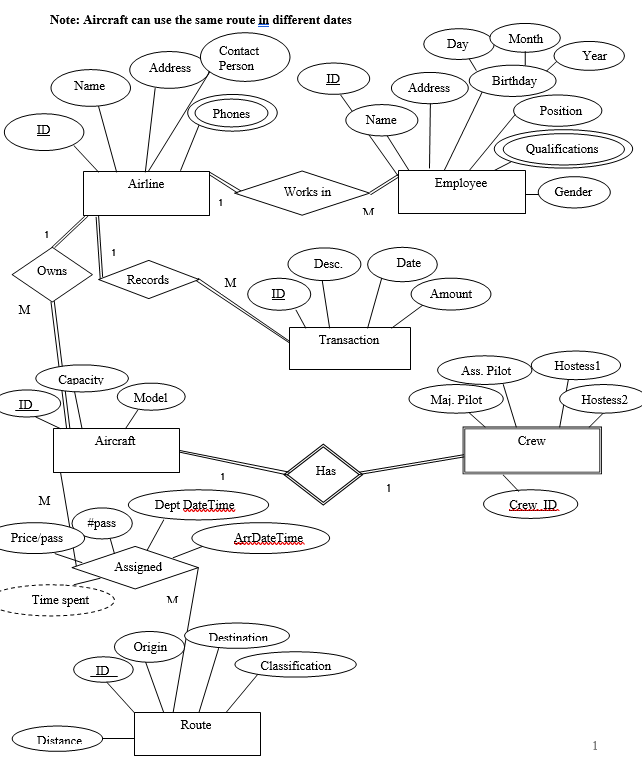
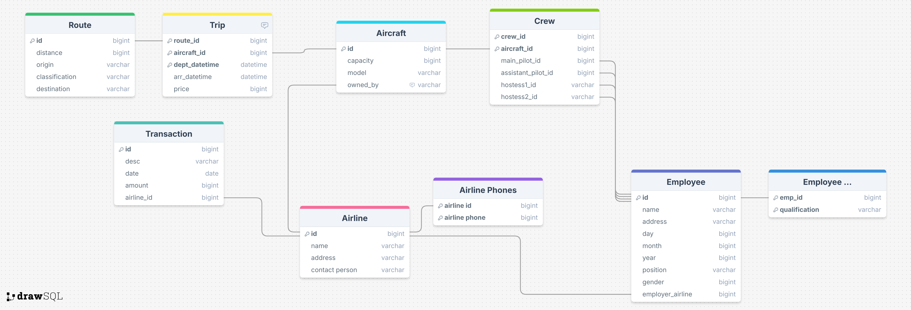

# ✈️ AirLine Database Project

This project implements an **Airline Management Database** system using
**Microsoft SQL Server**.\
It models the main entities and relationships involved in an airline's
operations --- including employees, aircrafts, crews, routes, and
transactions.

------------------------------------------------------------------------

## 🧩 Entity-Relationship Diagram (ERD)

The following diagram represents the conceptual design of the system:



------------------------------------------------------------------------

## 🧱 Database Schema

Here's the logical schema translated from the ERD:



------------------------------------------------------------------------

## 🗃️ SQL Database Creation Script

The database can be created using the provided SQL script file
[`createdb.sql`](SQL/createdb.sql) (or the SQL code below):

------------------------------------------------------------------------

## 🧠 Notes

-   Built for **Microsoft SQL Server**.
-   Relationships follow the ERD shown above.
-   Make sure to run the script in the **master** context or create the
    database `AirLineDB` first.

``` sql
CREATE DATABASE AirLineDB;
GO
USE AirLineDB;
```

------------------------------------------------------------------------

## 📸 Files Included

  File              Description
  ----------------- -----------------------------
  `ERD.png`         Entity-Relationship Diagram
  `Schema.png`      Logical schema diagram
  `createdb.sql`   Full SQL creation script

------------------------------------------------------------------------

## 🧑‍💻 Author

**Anas Abd El-Aziz**

------------------------------------------------------------------------
